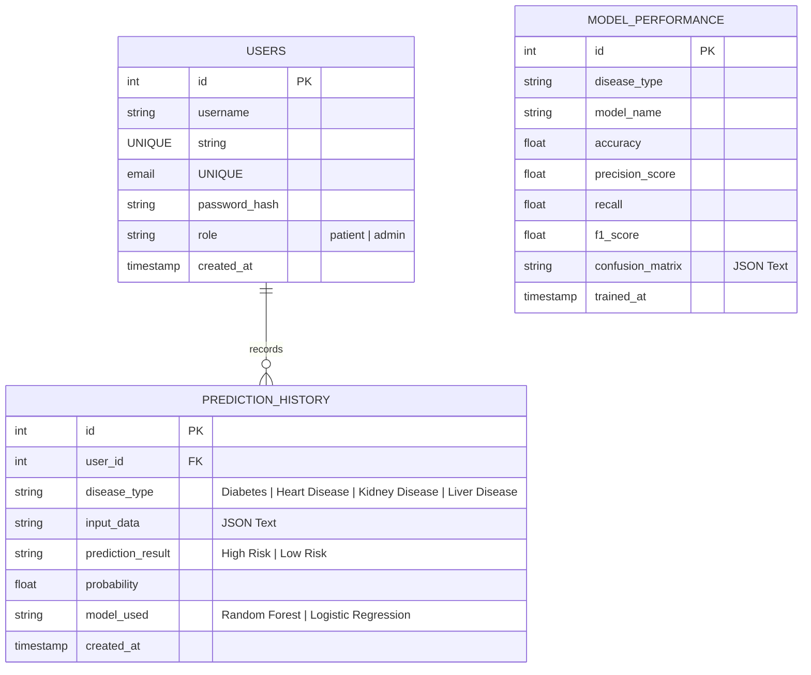

# Entity Relationship (ER) Diagram: MediPredict AI

The database architecture is designed with three core tables. It maps patient registration details to prediction summaries, while storing machine learning evaluation statistics separately to monitor model calibration over time.

## ER Diagram

## Schema Structural Breakdown

### 1. `users` Table
- Houses core login details.
- Hashed passwords (`password_hash`) are created using Werkzeug's SHA256 PBKDF2 algorithm.
- `role` controls permission bounds (e.g. patients can only see their own listings; admin can view the overall performance metrics, register users, and inspect global logs).

### 2. `prediction_history` Table
- Connects predictions to a specific user via `user_id`.
- `input_data` stores clinical parameters as a serialized JSON string, preserving flexibility across all four modules (Diabetes, Heart Disease, Kidney Disease, and Liver Disease).

### 3. `model_performance` Table
- Stores testing performance metrics of trained models.
- Loaded dynamically on the admin panel to chart accuracy comparisons.
