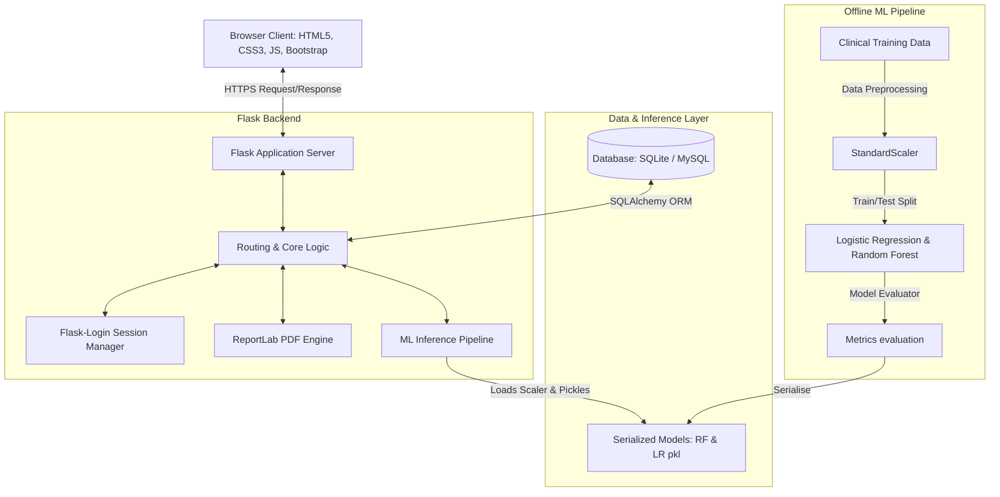

# System Architecture: MediPredict AI

The system architecture utilizes a standard MVC (Model-View-Controller) design pattern tailored for clinical machine learning applications. The browser client communicates with a Python Flask server which controls authentication, interfaces with the database, and calls Scikit-learn models for real-time predictions.

## Architecture Overview Diagram

## Description of Components

### 1. Presentation Layer (Frontend)
- **Bootstrap 5 & Vanilla CSS**: Provides a responsive, mobile-friendly design with HSL custom variables supporting standard Light and Dark modes.
- **Vanilla JavaScript**: Handles user side validations, dark mode toggle local storage sync, and dismisses flash alerts.
- **Chart.js**: Client-side canvas library that rendering dynamic health timelines and classification comparisons on dashboard and admin views.

### 2. Application Layer (Backend Controller)
- **Python Flask Server**: Orchestrates API requests, manages routing endpoints, and implements session management.
- **Flask-Login**: Houses standard authentication strategies ensuring secure session handling.
- **ReportLab PDF Engine**: Generates dynamically constructed PDF summaries of predictions including visual tables and recommendations.

### 3. Data & Storage Layer
- **SQLAlchemy ORM**: Implements database interactions in Python code, abstracting pure SQL. This allows the system to run seamlessly on SQLite (for quick verification) or a production MySQL server.
- **Scikit-learn Model Picklers (`.pkl`)**: Serialized representations of standard scalers and classifier algorithms loaded into memory on application startup.
